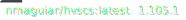
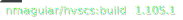
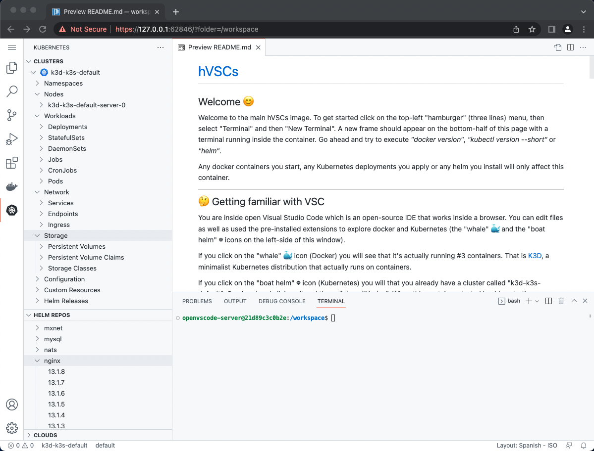

# hVSCs

 

A personal _"home VSCode space"_ base image to quickly deploy on wherever there is a docker installed (Linux, Mac or Windows (WSL or not)). It includes:
* Docker in Docker
* Kubernetes (K3D)
* Helm
* VSCode extensions for Docker, Kubernetes, YAML and XML
* Kubernetes SOCKS proxy server

The idea is to quickly have your own Docker & Kubernetes clean environment to test or learn. Since it uses K3D it's also possible to test in a simulated multi-node Kubernetes cluster. Your main Docker (and Kubernetes) won't be _"harmed"_ in the process. If something goes _"south"_ you just destroy the container and start another clean one.



## How to run it

### Linux/Windows

To run it in Linux/Windows:

````bash
docker run --rm -ti --init -d -p 127.0.0.1:8443:8443 -p 127.0.0.1:10080:1080 --privileged nmaguiar/hvscs
````

In a browser open the following URL (accepting the insecure certificate): https://127.0.0.1:8443

### Mac

Run in in a Mac:

````bash
docker run --rm -ti --init -d -p 127.0.0.1:8443:8443 -p 127.0.0.1:10080:1080 --privileged --cgroupns=host nmaguiar/hvscs
````

In a browser open the following URL (accepting the insecure certificate): https://127.0.0.1:8443

## How to customize it

To customize it just prepare any content you want and extend the image creating your own:

````dockerfile
FROM nmaguiar/hvscs

# To install any extra software you need uncomment the following 4 lines replacing "somepackage" by the packages you need and adding more RUN commands if needed:
#USER root
#RUN apt-get update\
# && apt-get install -y somepackage
#USER 1000

# Prepare a mycontents folder with a README.md markdown file on the root.
# This README.md will be shown upon opening the browser
COPY --chown=1000:1000 mycontents /workspace
````

You can also follow the [samples/buildCustomContent](samples/buildCustomContent) directly. For that just clone this GIT repo and start the hVSCs container on it:

````bash
git clone https://github.com/nmaguiar/hvscs
cd hvscs
docker run --rm -ti --init -d -p 127.0.0.1:8443:8443 -p 127.0.0.1:10080:1080 -v $(pwd)/samples/buildCustomContent:/workspace --privileged nmaguiar/hvscs 
````

and the open your browser on the address: https://127.0.0.1:8443

> Don't forget to add the option _'--cgroupns=host'_ if running on a Mac

## How to access the SOCKS proxy

You can configure any browser to use the SOCKS proxy on port 10080. Other clients, like DBeaver, also support SOCKS proxy definitions. See more in https://github.com/nmaguiar/socksd.

### In Windows

On a Windows command-prompt execute:

````powershell
curl https://ojob.io/win/newChrome.bat -O newChrome.bat
newChrome.bat hvscs localhost:10080
````

### In Mac

On a Mac OS terminal: 

````bash
curl https://ojob.io/mac/newChrome.sh | sh -s hvscs localhost:10080
````

### In Linux

On a Linux terminal
````bash
curl https://ojob.io/unix/newChrome.sh | sh -s default localhost:10080
````

---

## Using a script

To run it in Linux/Mac/Windows WSL:

````bash
$ curl https://ojob.io/unix/hvscs.sh | sh
````

To run it in Windows:

````
C:\myWorkspace> curl https://ojob.io/win/hvscs.bat -O hvscs.bat
C:\myWorkspace> hvscs.bat
````

---

You can also try out the included simple example:

````bash
$ curl https://ojob.io/unix/hvscs_learn.sh | sh
````

or in Windows:

````bash
C:\myWorkspace> curl https://ojob.io/win/hvscs_learn.bat -O hvscs_learn.bat
C:\myWorkspace> hvscs_learn.bat
````

## Other settings and troubleshooting

Both the windows and unix/linux/mac/wsl script have variables for you to change if needed (in case you need different ports or options). Just download the corresponding script and change the lines on the begining of the file:

````ini
WEB_PORT=8888
SSH_PORT=22222
SOCKS_PORT=1080
NAME=hvscs
WORKSPACE=`pwd`
IMAGE=nmaguiar/hvscs
SSH_PASS=Password1
````

or directly when calling (only on unix/mac):

````bash
$ curl https://ojob.io/unix/hvscs_learn.sh | _WEB_PORT=8888 _SSH_PORT=22222 _SOCKS_PORT=1080 _NAME=hvscs _WORKSPACE=`pwd` _IMAGE=nmaguiar/hvscs _SSH_PASS=Password1  sh
````

**Description:**

> These can also be provided directly to the running image as environment variables

| Variable | Description |
|----------|-------------|
| WEB_PORT | The port where the VSCode web interface will be served from. |
| SSH_PORT | The port to which you can connect through SSH and to establish any tunnels needed. |
| SOCKS_PORT | The port used locally to map the access to the Kubernetes internal socks proxy server. |
| NAME | The unique name to identify the running hVSCs containers. |
| WORKSPACE | The local folder to map with /workspace internal folder. |
| IMAGE | The hVSCs image to use. | 
| SSH_PASS | The SSH password to setup to access the container. |
| NOHTTPS | If defined no HTTPS proxy on port 8443 will be started. |
| NOPUBLIC | If defined the SOCKS proxy on port 1080 will be just local to the container. |
| NOSSH | If defined no SSH daemon on port 22 will be started. |
| NODOCKER | If defined no Docker daemon will be started. |
| NOVSCODE | If defined no VS Code will be started. |
| NOK8S | If defined no Kubernetes cluster will be created (requires that NODOCKER is not defined) |

## Running on a different machine/server

Just download the script to the corresponding machine/server, customize ports/names/password if needed and execute:

````bash
$ chmod u+x hvscs.sh
$ ./hvscs.sh start
````

On your workstation open your browser on the provided URL and execute the SSH command provided so you can set the socks proxy of your browser (e.g. Firefox recommeded to avoid changing your OS proxy settings) to access directly to the container's Kubernetes.

once finished:

````bash
$ ./hvscs.sh stop
````

**Or**, using curl:

````bash
$ curl https://ojob.io/unix/hvscs_learn.sh | _OP=start  sh
````

and to stop:

````bash
$ curl https://ojob.io/unix/hvscs_learn.sh | _OP=stop  sh
````
