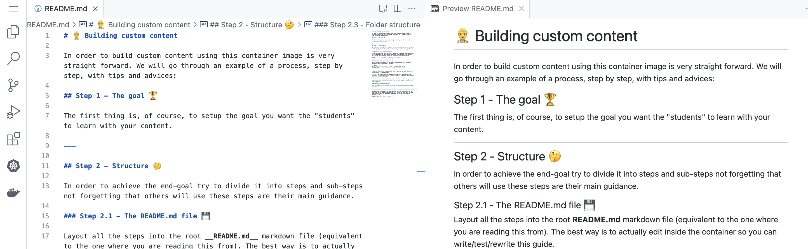

# 👷‍♂️ Building custom content

In order to build custom content using this container image is very straight forward. We will go through an example of a process, step by step, with tips and advices:

## Step 1 - The goal 🏆

The first thing is, of course, to setup the goal you want the "students" to learn with your content.

---

## Step 2 - Explore 🗺

If it's the first time using this image try also the included guide. It will guide you through:

* Launching a simple Kubernetes deployments
* Interacting with the Kubernetes deployments from a browser
* Interacting using other client applications in your host
* Introducing to multi-node Kubernetes setups

 For that just relaunch this container without any workspace mapped (and when you finish come back to this guide 😇):

````bash
docker run --rm -ti --init -d -p 127.0.0.1:8443:8443 -p 127.0.0.1:10080:1080 --privileged nmaguiar/hvscs
````

> Keep in mind that if you are doing this from a Mac you need to add the extra option _'--cgroupns=host'_

There is also a __private container registry__, running on _localhost:5000_, that you can use to hold container images that will be available to the internal Kubernetes cluster.

You can visualize it 🔎 by clicking on the 🐳 icon (Docker) on the left pane of this window. Then click on "Connect Registry", select "Generic Docker Registry", enter ````http://localhost:5000````, then enter again for the username (since there isn't one) and you will be able to explore the _container registry_ contents.


---

## Step 3 - Structure 🤔

In order to achieve the end-goal try to divide it into steps and sub-steps not forgetting that others will use these steps are their main guidance.

### Step 3.1 - The README.md file 💾

Layout all the steps into the root __README.md__ markdown file (equivalent to the one where you are reading this from). The best way is to actually edit inside the container so you can write/test/rewrite this guide.

But how can you persist the content you create here? 

### Step 3.2 - Editing "inception" 📝

Well, to keep the content you can start this container in a _slightly different_ way if you haven't already:

````bash
docker run --rm -ti --init -d -p 127.0.0.1:8443:8443 -p 127.0.0.1:10080:1080 -v `pwd`:/workspace --privileged nmaguiar/hvscs
````

> Keep in mind that if you are doing this from a Mac you need to add the extra option _'--cgroupns=host'_

This will map the folder from where you started this container to the _/workspace_ inside the container. This is the main _workspace_ that VS Code will use once it's started.

Now you can create your own README.md renaming this file to a different name, in the same root folder, so you can keep reading:

````bash
mv README.md original.README.md
touch README.md
````

To view it as rendered markdown just _right-click_ the original.README.md file, on the VS Code File Explorer, and choose __"Open Preview"__.

> You can have more workspaces inside an image but you should keep always one as the "main" workspace. Keep in mind that the simpler the easier for your students.

### Step 3.3 - Folder structure

This is VS Code so you can edit files and see the markdown preview at the same time:



Although the __README.md__ is important it's not everything. You can create an entire folder structure that it's useful for your goal. VS Code also makes it easy for end-users to browser the folder structure and explore it. 

For us writers it makes it easy to create files, folders and upload content also. Drag your mouse over the VS Code File Explorer and it will reveal buttons to create files and folders.

Right-click on a folder and you have the option to upload any file from your host. Go ahead! Find the screenshot I just used above. You can even edit this README.md file too 😎.

And it's Linux 😬. Open the terminal pane (Menu | View | Terminal) and can use your favourite unix commands.

### Step 3.4 - Beautifing contents 🌷

You may have notice that use emoticons throughout the text 😊. Of course you don't have too but I find it more _appealing_ to readers given them some color on what they are reading besides screenshots and commands.

For that I have, on another tab, the site: https://getemoji.com. I just go there, select the emoticon I like, and the copy+paste to the edit pane in VS code 👀.

Another important tip is too include pieces of code for the _readers_ to easily copy+paste to the terminal pane:

````bash
echo --- && uname -a
echo --- && uptime 
echo --- && sh /workspace/scripts/helloWorld.sh
````

_(no one is looking, go ahead, try it now 😋)_

Try also not to have large pieces of text to read without:
* any color 💐
* _formatting_
* ````code segments```` (with __syntax highlighting__) to copy
* 🖼 screenshots

### Step 3.5 - What if it fails... 🚧

Readers will try to copy+paste the commands you give them to execute and they might go back and forward trying to fix if they don't get the expected outcome. 

If it's completely broken, of course, they always have the _"nuclear"_ option 🔥 of stopping and restarting this container getting them back to the __safe place__ where they started.

But having to repeat all commands again might take some time so if it's easy to revert just include a note for it (for example: _"if this fails just execute: ````rm -rf /workspace/output````"_)

> Yes, do use absolute paths as you don't know where the reader might have gone in the terminal window.

---

## Step 4 - Testing 

Once you finished the first version of your content you need to read it again and test it.

So simply go back to the terminal where you started the container:

1. Stop the container
2. Start again the container with the same options
3. (optionally) Clear your browser's cache
4. Follow your steps again
5. Correct if needed

> The best way is actually to use the newChrome.bat or newChrome.sh script that will "give you" a clean Chrome browser exiting everytime you stop the container.

---

## Step 5 - Pack it 🛍

To pack your contents it might be as simple as just creating a Dockerfile like this:

````Dockerfile
FROM nmaguiar/hvscs

COPY --chown=1000:1000 mycontents /workspace
````

and then building it:

````bash
docker build -t mycontent .
````

> Since you are building as an additional layer multiple content containers that you build will actually share the common 'nmaguiar/hvscs' layer.

__OR__

You can simply reuse this image and provide your readers with some instructions like:

1. Download zip file _"mycontents.zip"_ to an empty folder
2. Run the _"mycontents.bat"_ file that starts this container mapping the workspace to the contents you packed in _"mycontents.zip"_ 

__OR__

you might need a more complex setup by customizing further the Dockerfile.

---

## Step 6 - Distributing 🚚

To distribute just provide your custom container or your contents zip file. Don't forget, of course, to include very simple and easy instructions to follow.

If necessary also include links to tutorials on how to install _docker-desktop_ or _rancher-desktop_ or any other container runtime distribution.

---

__Happy writing!__ 🥳